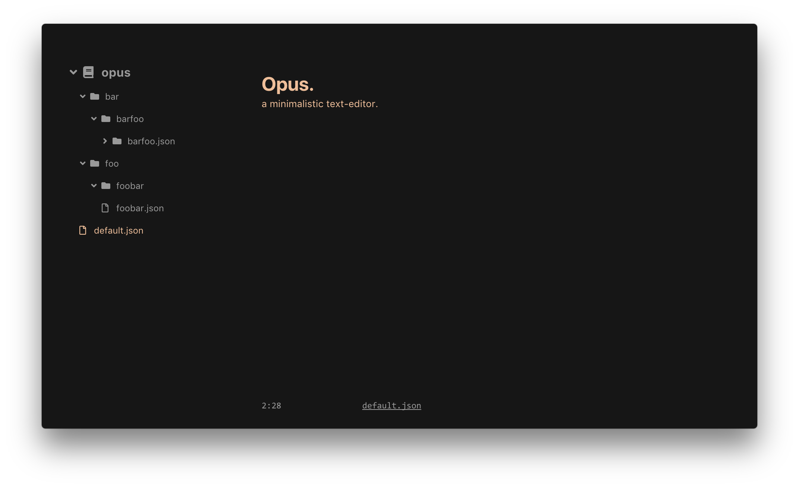

# Opus

a minimalistic text-editor.

## Installation

You can download the latest macOS binary from [releases](https://github.com/pacocoursey/Opus/releases/latest).

Alternatively, you can run Opus locally from the command line:

```
$ git clone https://github.com/pacocoursey/opus.git
$ cd opus
$ npm install
$ npm start
```

Keep in mind this project is still under development.



## Keybinds

### Application

- Preferences: `CmdOrCtrl+,`
- Close Window: `CmdOrCtrl+W`
- Hide: `CmdOrCtrl+H`
- Hide Others: `CmdOrCtrl+Option+H`

### Files

- New Window: `CmdOrCtrl+Shift+N`
- New: `CmdOrCtrl+N`
- Open: `CmdOrCtrl+O`
- Save: `CmdOrCtrl+S`
- Save As: `CmdOrCtrl+Shift+S`
- Toggle Sidebar: `CmdOrCtrl+\`

### Editor

- Bold: `CmdOrCtrl+B`
- Italic: `CmdOrCtrl+I`
- Underline: `CmdOrCtrl+U`
- Strikethrough: `CmdOrCtrl+Shift+S`
- Subscript: `CmdOrCtrl+Shift+-`
- Superscript: `CmdOrCtrl+Shift++`
- Header 1: `CmdOrCtrl+1`
- Header 2: `CmdOrCtrl+2`
- Header 3: `CmdOrCtrl+3`
- Unordered list: `CmdOrCtrl+L`
- Ordered list: `CmdOrCtrl+Shift+L`
- Blockquote: `CmdOrCtrl+Shift+.`
- Code-block: `CmdOrCtrl+Shift+C`
- Indent: `CmdOrCtrl+]`
- Outdent: `CmdOrCtrl+[`
- Clear formatting: `CmdOrCtrl+0`

#

<p align="center">
  <a href="http://paco.sh"></a>
</p>
