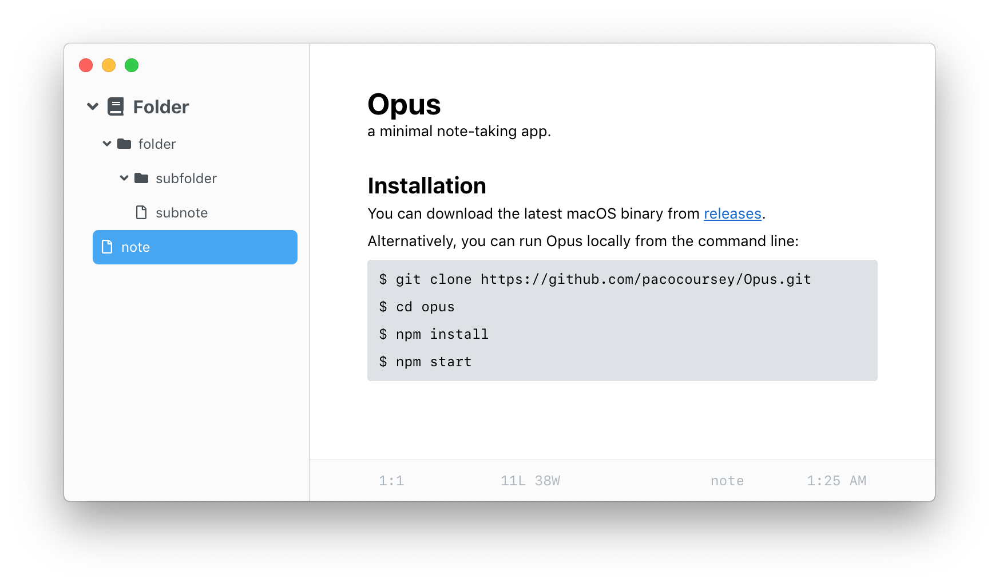
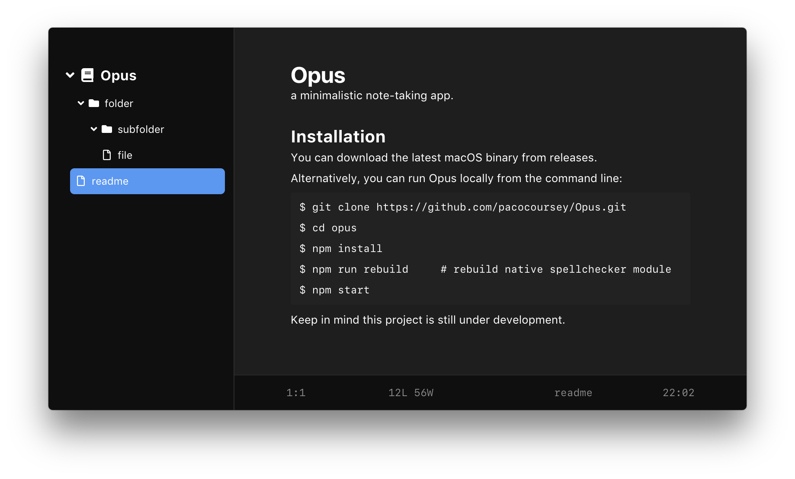

<p align="center">
  
</p>

# Opus

a minimal note-taking app.

## Installation

You can download the latest macOS binary from [releases](https://github.com/pacocoursey/Opus/releases/latest).

Alternatively, you can run Opus locally from the command line:

```bash
$ git clone https://github.com/pacocoursey/Opus.git
$ cd opus
$ npm install
$ npm start
```




## Description

Opus aims to be a mix between a text-editor and note-taking application. It reads and writes `.note` files from your native file system. This means it works well with tools like Dropbox for syncing files across your devices.

Much like a code editor, Opus opens folders and allows you to edit the files inside. You can have multiple windows open, each with their own folder as a starting point.

## Goals

Features I'd like to implement:

### v2.0.0

- [X] Find
- [X] Goto
- [X] Replace
- [X] New logo
- [X] Dark Mode
- [X] Spellchecker
- [X] Add h4, h5, h6 headings
- [X] Add custom scroll bar to editor
- [X] Show current time in the footer
- [X] Setting to hide and show footer
- [X] Add an introductory window & flow
- [X] Put time in 12h format with PM/AM
- [X] Update menu based on active window
- [X] Filter files to match only .note files
- [X] Remember window x, y, height, and width
- [X] Show recent projects based on most recently opened
- [X] Improve sidebar design and general application feel
- [X] Support exporting note files as .txt, .html, and .md
- [X] Improve introduction flow, add images and more context
- [X] Overflow the sidebar when there are many folders/files
- [X] Automatically update file contents if edited elsewhere
- [X] Fix "cannot read property 'path' of null" tree-view bug
- [X] Ability to have multiple projects (folders) open at once
- [X] Change document.title value for editor window to file name
- [X] Fix superscript keyboard shortcut, undo formatting correctly
- [X] Improve the way cursor is displayed on first element of a list
- [X] Add Escape keyboard shortcut to clear current cursor formatting
- [X] Show document stats in the footer, improve cursor position stats

## Keyboard Shortcuts

### Application

- Preferences: `CmdOrCtrl+,`
- Close Window: `CmdOrCtrl+W`
- Hide: `CmdOrCtrl+H`
- Hide Others: `CmdOrCtrl+Option+H`

### Files

- New Window: `CmdOrCtrl+Shift+N`
- New: `CmdOrCtrl+N`
- Open: `CmdOrCtrl+O`
- Save: `CmdOrCtrl+S`
- Save As: `CmdOrCtrl+Shift+S`
- Toggle Sidebar: `CmdOrCtrl+\`

### Editor

- Separator: `CmdOrCtrl+Shift+H`
- Header 1: `CmdOrCtrl+1`
- Header 2: `CmdOrCtrl+2`
- Header 3: `CmdOrCtrl+3`
- Bold: `CmdOrCtrl+B`
- Italic: `CmdOrCtrl+I`
- Underline: `CmdOrCtrl+U`
- Strikethrough: `CmdOrCtrl+Shift+S`
- Unordered list: `CmdOrCtrl+L`
- Ordered list: `CmdOrCtrl+Shift+L`
- Quote: `CmdOrCtrl+Shift+.`
- Code: `CmdOrCtrl+Shift+C`
- Code-block: `CmdOrCtrl+Alt+C`
- Superscript: `CmdOrCtrl+Alt+Plus`
- Subscript: `CmdOrCtrl+Alt+Minus`
- Indent: `CmdOrCtrl+]`
- Outdent: `CmdOrCtrl+[`
- Clear formatting: `CmdOrCtrl+0`
